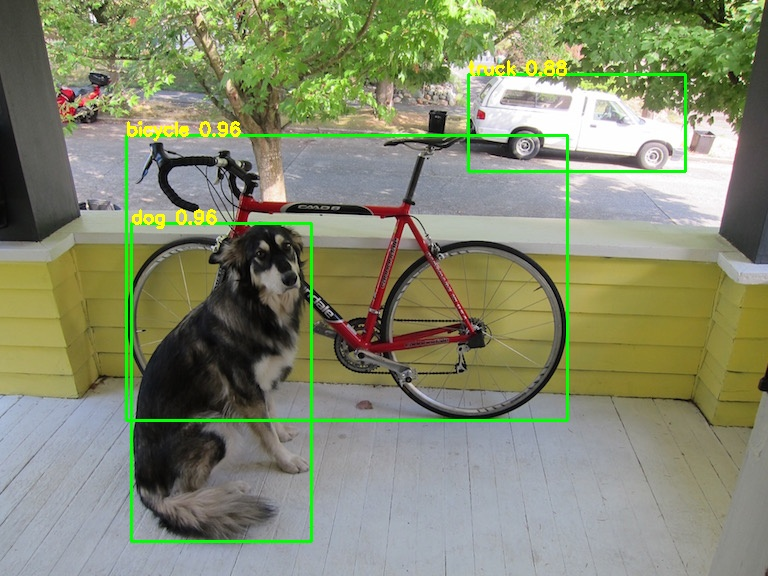
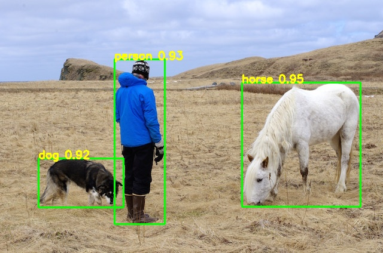
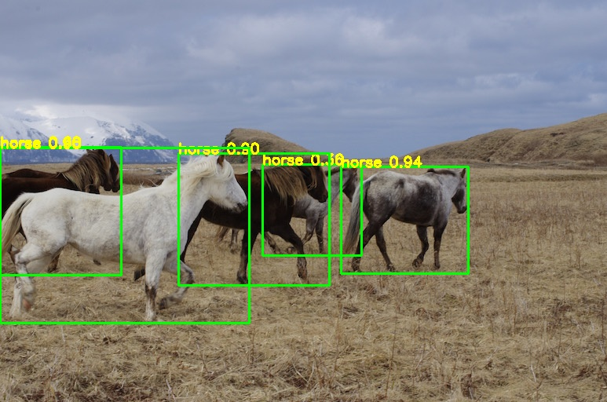
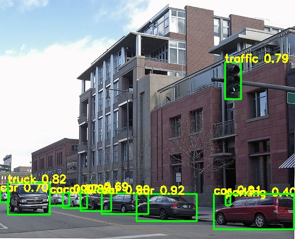

# YOLOV9_PyTorch
yolov9's classic model to pytorch

## Demo
     
   

## 中文解读
传送门

## Model
[yolov9-c-converted-samylee.pt](https://pan.baidu.com/s/1BlZREzBEAydSSLdtWx8s_w), 提取码8888

## Reference
https://github.com/WongKinYiu/yolov9  
https://blog.csdn.net/samylee  
